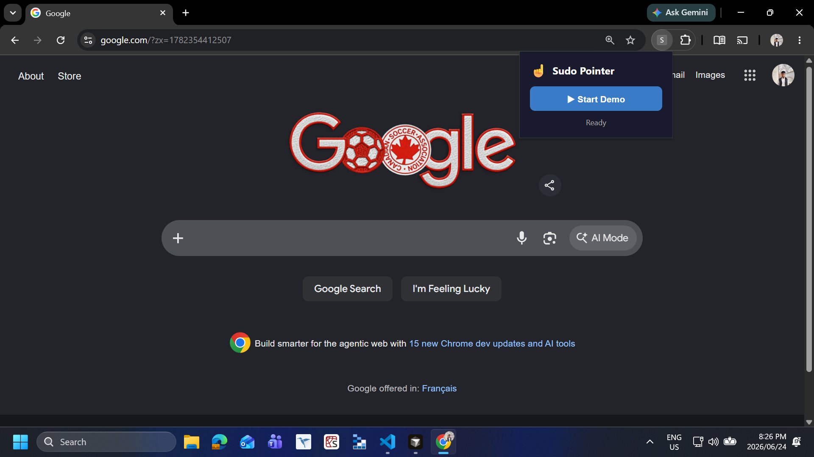
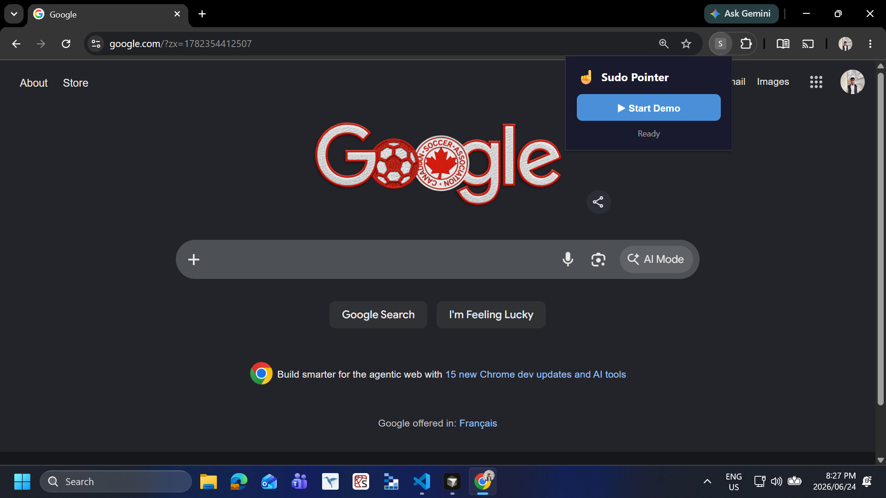
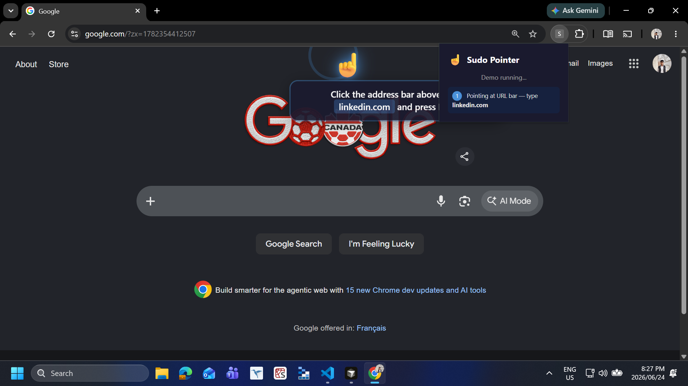
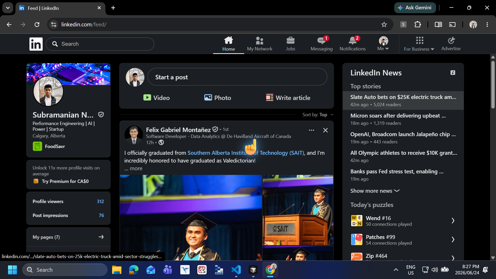

# VoicePoint ☝️

**Every day, millions of people stare at a screen and don't know where to click.** Software onboarding is a universal pain — new hires, customers, and even experienced users get lost in menus, buttons, and workflows that nobody ever taught them. The existing solutions (videos, screenshots, text guides) are all *passive*: they show, but they don't *guide*. VoicePoint solves this by placing a **live, autonomous virtual pointer** (a floating ☝️ hand) on top of any webpage that moves, clicks, and highlights in real time — like a teacher standing behind you, pointing at exactly what to do. This is not another tutorial tool. This is a fundamental rethinking of how software teaches itself: a programmable, scriptable, AI-ready overlay that turns any UI flow into an interactive guided walkthrough without recording a single video or writing a single line of documentation.

---

## The Problem

**Software onboarding is broken. And it's a problem everyone has felt.**

New hires stare at a screen flooded with menus, buttons, and fields — overwhelmed. Trainers record Loom videos that nobody re-watches. Documentation rots the moment the UI changes. Users get stuck on the same trivial flows, again and again, asking the same questions in Slack.

The tools we have today are all passive:

| Approach | What's wrong |
|---|---|
| **Screen recordings** | The viewer watches, they don't do. Impossible to update — re-record the whole thing. |
| **Screenshots with arrows** | Static. Break when UI updates. Can't show multi-step flows. |
| **In-app tours (Intro.js, Shepherd)** | Require modifying the target app's codebase. Expensive to build and maintain. |
| **Text guides / Notion docs** | "Click the button in the top-right corner" — which button? Context-switching hell. |
| **Clicky (macOS)** | OS-level app, Mac-only, requires install and Accessibility permissions. Not embeddable. |

**The core gap: there is no lightweight, programmable way to visually guide someone through a UI in real time without modifying the target application.**

---

## The Solution

VoicePoint is a Chrome extension that places a **second cursor** on your screen — an autonomous ☝️ pointer that moves on its own, clicks with animation, and highlights elements. It runs in a transparent overlay that never blocks your real mouse or keyboard. The pointer can:

- Glide to any coordinate on the page with smooth CSS transitions
- Perform a click animation (compress, overshoot, settle) with a ripple ring
- Highlight any element with a pulsing blue glow
- Show instructional tooltips that fade in and out
- Survive page navigations — it follows the user from one page to the next

<p align="center">
  
  &nbsp;&nbsp;
  
</p>

---

## Why This is Different

**The core idea is surprisingly simple yet entirely unexplored: a second cursor that isn't controlled by a mouse.**

VoicePoint is the first browser-native "sudo pointer." Instead of a person recording their screen, VoicePoint *programmatically performs* the demonstration — meaning it can be scripted, replayed, version-controlled, and eventually driven by an AI that reads the page and decides where to point.

This inverts the traditional tutorial model:

- **Before:** A human does the work once, records it, and everyone watches the recording.
- **After:** A script (or AI) describes the actions, and VoicePoint performs them live on the real page. Every time. Never out of date.

The architecture is AI-ready from day one: the service worker speaks a simple message protocol (`{ type: 'point-to', x, y, label }`), which means plugging in an LLM that observes the screen via screenshot and sends pointer commands is a matter of adding the API call — no restructuring needed.

---

## How It Works

**The engineering challenge:** Chrome Manifest V3 eliminated persistent background pages. Content scripts declared in the manifest only inject into pages loaded *after* extension installation — meaning already-open tabs are invisible to the extension. And yet the pointer must survive the user navigating from one page to another.

**The solution is a three-part state machine:**

```
inactive → [Start Demo] → url_bar_step
                                ↓ (user types linkedin.com, navigates)
                          linkedin_step
                                ↓ (button found, pointed at)
                          done → cleanup → inactive
```

1. **Programmatic injection** — The service worker uses `chrome.scripting.executeScript()` + `insertCSS()` to inject the content script and styles into the active tab on demand. A `chrome.tabs.onUpdated` listener re-injects on every navigation while the demo is active. This is more reliable than manifest-declared content scripts because it works on tabs that existed before the extension was loaded.

2. **State persistence** — `chrome.storage.session` stores `{ demoActive: true }`. This API was designed for MV3's ephemeral service worker lifecycle: it survives page navigations but clears on browser close, making it ideal for session-scoped state.

3. **Element detection with resilience** — LinkedIn's React-based feed loads progressively. The "Create Post" button can appear 5-15 seconds after the page loads, and LinkedIn A/B tests different layouts with different CSS selectors. VoicePoint polls every 500ms for up to 25 seconds using 8 fallback selectors:

```js
const SELECTORS = [
  'button[aria-label="Create a post"]',
  'button[aria-label="Start a post"]',
  '.share-box-feed-entry__trigger',
  '[data-control-name="create_post"]',
  '.share-creation-state__trigger',
  '.feed-shared-controls__trigger',
  'button[data-trigger="share-box"]',
];
// Fallback: text-match any <button> or <div role="button">
```

4. **Pointer positioning** — The ☝️ emoji (U+261D) points upward. The fingertip is at the top edge, horizontally centered. To point at an element:

```js
const btnX = rect.left + rect.width / 2 - POINTER_SIZE / 2; // 20
const btnY = rect.top - 8; // fingertip just above the element
```

An 8px blue target dot follows the fingertip with the same CSS transition, eliminating ambiguity caused by emoji rendering differences across platforms.

5. **Scroll-aware timing** — After `button.scrollIntoView({ behavior: 'smooth' })`, VoicePoint waits for the `scrollend` event (with a 1200ms timeout fallback) before reading `getBoundingClientRect()`. This guarantees the position is measured after the scroll animation finishes.

---

## The Demo Flow

This is the complete end-to-end experience — every step works, no external dependencies, no API keys:

<p align="center">
  
  &nbsp;&nbsp;
  
</p>

1. **Click "Start Demo"** in the popup → the service worker sets `demoActive: true` and injects the overlay into the active tab.

2. **☝️ hand appears** at screen center with a scale-in animation (`0 → 1.2 → 1`), then glides to `(50vw, 8px)` — the URL bar area — using a `cubic-bezier(0.22, 1, 0.36, 1)` transition that overshoots then settles, mimicking a human hand gesture.

3. **Click animation plays:** the hand compresses to 85% scale, shifts down 4px (the "press"), then overshoots to 110% before settling. A blue ripple ring expands from the click point.

<p align="center">
  
</p>

4. **Tooltip appears:** *"Click the address bar above, type linkedin.com and press Enter"* — a dark translucent card with a blue accent border, readable on any background.

5. **User navigates to LinkedIn** — the service worker detects the URL change via `chrome.tabs.onUpdated`, re-injects the content script, which reads `demoActive: true` from storage and starts the LinkedIn step.

6. **Retry loop activates** — polls for the "Create Post" button every 500ms. Meanwhile, a "Looking for the Create Post button..." tooltip keeps the user informed.

7. **Button found** — VoicePoint scrolls it into view, waits for scroll completion, calculates its position, and glides the ☝️ hand to the button's top-center.

<p align="center">
  
</p>

8. **Button is highlighted** with a pulsing blue glow (`box-shadow` cycling between 0px and 6px spread every 1.5s) and a border ring via `::after` pseudo-element.

9. **✓ DONE overlay** fades in over a semi-transparent backdrop — "✓ DONE" scales up with a bounce ease (`cubic-bezier(0.34, 1.56, 0.64, 1)`), and a subtitle reads *"LinkedIn post creation ready"*.

10. **Auto-cleanup** after 5 seconds — `demoActive` reset to `false`, overlay removed, popup returns to "Ready".

**That's it. No video. No screenshots (except this README). A 10-second interactive experience replaces a 30-second screen recording and communicates the action with zero ambiguity.**

---

## Real Pain, Real Solution

**This project exists because I've been the person who doesn't know where to click.**

Every team I've been on uses Loom, Notion docs, and Slack messages to onboard new teammates. New hires watch a 15-minute Loom, alt-tab to the app, and immediately get stuck on step 3. They ping the author, wait for a reply, and lose 30 minutes of flow. I've been that new hire. I've been that author answering the same Slack question four times.

VoicePoint bridges the gap between "watch a video" and "do it yourself" by *pointing at the actual UI while you perform the action*. The user doesn't watch a recording — they follow a live pointer on the real page, in real time, at their own pace. The pointer waits. It never gets frustrated. It never says "as you can see..." and clicks past something important.

**The impact:** Any Chrome extension is zero-friction — install once, works on any page, no code changes to the target app. This means:
- A SaaS company can create guided tours without embedding JavaScript into their product
- A training team can build walkthroughs without recording a single video
- A new hire can learn Salesforce, Notion, or Slack setup in 5 minutes instead of 45
- An accessibility user can follow along as the pointer highlights the next interaction target
- A QA engineer can record a sequence of pointer actions and replay them as a reproducible test

---

## Design & Experience

Every visual decision was made with a specific goal: **the pointer must feel human, not robotic.**

| Element | Why |
|---|---|
| **☝️ hand emoji** | Universally recognized, cross-platform, inherently friendly — feels like a person pointing, not a machine cursor. |
| **Blue target dot (8px, `#4A90D9`)** | Eliminates ambiguity from emoji rendering differences. White border + box-shadow glow makes it visible on any background. |
| **`cubic-bezier(0.22, 1, 0.36, 1)` transitions** | Ease-out with overshoot — the pointer arrives quickly and settles naturally, mimicking a hand gesture. |
| **Dark tooltip card** | `rgba(26, 26, 46, 0.95)` with blue accent border — readable on light or dark pages. Slide-up entrance animation. |
| **Green ✅ DONE (72px, `#2ecc71`)** | Large, celebratory, unambiguous. Bounce-in entrance with semi-transparent backdrop. |
| **Ripple effect** | Circular ring expands from click point — haptic-like visual feedback. |
| **Pulsing highlight** | `box-shadow` cycles 0→6px spread — attention-grabbing without being distracting. |
| **`pointer-events: none`** | The overlay never blocks clicks, typing, scrolling, or any user interaction. Ever. |

---

## What We Learned

This project stretched us into unfamiliar territory across three dimensions:

**1. Chrome Extension Manifest V3** — MV3's service worker lifecycle is significantly more restrictive than MV2's background pages. The service worker can be terminated after 30 seconds of inactivity, meaning timeouts and promise chains must be carefully managed. We learned to rely on `chrome.storage.session` (a MV3-only API) for state persistence and `chrome.scripting.executeScript()` for reliable content injection. The transition from `background.html` (MV2) to a service worker (MV3) requires a fundamentally different mental model — you can't assume your process lives forever.

**2. CSS animation timing for perceived naturalness** — Getting the ☝️ hand to feel *human* required deep work with cubic-bezier curves. The difference between a robotic pointer and a natural one is ~200ms and the right easing. We tuned the click animation's compression phase (0→40%, scale 1→0.85, translateY 0→4px) to match the slight spring of a real finger pressing a button, and the overshoot phase (70%, scale 1.1) to mimic the micro-correction of a hand aiming at a target.

**3. DOM resilience against dynamic SPAs** — LinkedIn's React-based feed is a worst-case scenario for content scripts. It loads progressively, A/B tests different layouts, and changes selectors without notice. Building the retry loop with 8 fallback selectors and a 25-second timeout taught us that *"find the element"* is the hardest problem in browser automation. We also learned that `scrollIntoView` with `{ behavior: 'smooth' }` doesn't block — you must listen for the `scrollend` event or use a generous timeout before measuring coordinates.

**What's next:** VoicePoint's architecture is designed for an AI agent where an LLM (Claude, GPT) observes the screen via screenshot, decides the next action, and sends `[POINT: x, y, label]` commands to the pointer. The message protocol is already in place — the background accepts `{ type: 'point-to', x, y, label }` and the pointer moves. The next step is adding the vision loop (screenshot → LLM → pointer command) with a bring-your-own-key model.

---

## Architecture

```
┌─────────────┐     ┌──────────────────┐     ┌─────────────────┐
│  popup.html │────▶│  background.js   │────▶│  content.js     │
│  popup.js   │     │  (service worker)│     │  (injected)     │
└─────────────┘     └──────────────────┘     └─────────────────┘
                           │                          │
                           ▼                          ▼
                    chrome.storage              pointer.css
                    .session                   (injected CSS)
                    { demoActive }
```

The extension uses:
- **Manifest V3** with `scripting` + `activeTab` permissions
- `chrome.scripting.executeScript` / `insertCSS` for programmatic injection
- `chrome.storage.session` for state across page navigations
- `chrome.tabs.onUpdated` for re-injection after navigation

---

## Directory structure

```
voicepoint/
├── manifest.json         # Chrome extension manifest (MV3)
├── background.js         # Service worker — state management, injection, tab tracking
├── content.js            # Injected script — pointer creation, animation, step logic
├── pointer.css           # All styles: pointer, tooltip, highlight, DONE overlay, ripple
├── popup.html            # Extension popup UI
├── popup.js              # Popup logic — start/stop buttons, step indicators
├── screenshots/          # Demo screenshots for the README
│   ├── popup.png
│   ├── urlbar-pointer.png
│   ├── tooltip.png
│   └── linkedin-done.png
├── AGENTS.md             # AI agent prompt / architecture reference
├── .cursorrules          # Cursor IDE configuration
└── README.md
```

---

## Development

### Load the extension

1.  Open `chrome://extensions/`
2.  Toggle **Developer mode** ON
3.  Click **Load unpacked** → select the `sudo-pointer-extension/` directory

### How to test

1.  Open any page (e.g. `google.com`)
2.  Click the VoicePoint icon in the Chrome toolbar → **Start Demo**
3.  Watch the ☝️ pointer appear and point at the URL bar
4.  Type `linkedin.com` in the URL bar and press Enter
5.  On LinkedIn, the pointer moves to the "Create a Post" button, highlights it, and shows **✓ DONE**

---

## Roadmap

| Phase | Feature | Status |
|---|---|---|
| **MVP** | ☝️ Sudo pointer with 2‑step LinkedIn demo | ✅ Complete |
| **Phase 2** | Record & replay — capture pointer positions and actions | 🔜 Next |
| **Phase 3** | Voice commands — "Point at the profile menu" | 🔜 Next |
| **Phase 4** | AI agent integration (LLM reads screen → moves pointer) | 🌐 Future |
| **Phase 5** | Multi‑step script engine — define flows in JSON | 🌐 Future |
| **Phase 6** | Cross‑browser (Firefox, Edge, Safari) | 🌐 Future |

---

## License

MIT — see [LICENSE](LICENSE).

---

*VoicePoint is inspired by Farza's [Clicky](https://github.com/farzaa/clicky) — an AI teacher that lives next to your cursor. This is a browser‑native take on the same idea: a lightweight, scriptable pointer overlay that helps people learn software by doing. No installation. No video. Just a hand that points.*
